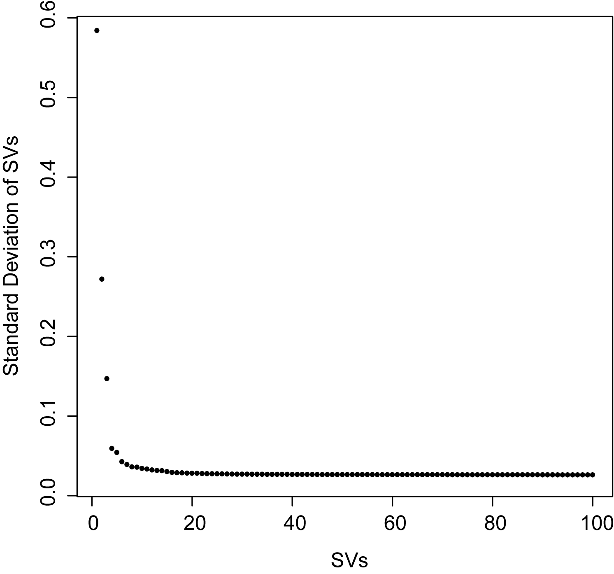
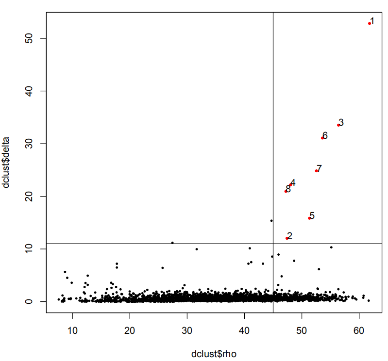

# scART

## Processed dataset 

## Dependencies (for R >= 3.4.4) 

The following packages have to be installed manually before installing scART:

```{r}
if(!requireNamespace("BiocManager", quietly = TRUE)){
  install.packages("BiocManager")}
BiocManager::install()
setRepositories(ind=1:2)

# install.packages("Signac")
# install.packages("devtools")
devtools::install_github("timoast/signac", ref = "develop")
library(Matrix);
library(proxy);
library(gplots);
library(Rtsne);
library(densityClust);
library(scatterplot3d);
library(Biobase);
library(RColorBrewer);
library(ggplot2);
library(monocle);
library(text2vec);
library(ChIPseeker)
library(GenomicFeatures)
library(data.table)
library(textTinyR)
library(org.Hs.eg.db)
library(org.Mm.eg.db)
library(BSgenome.Mmusculus.UCSC.mm10)
library(BSgenome.Hsapiens.UCSC.hg19)
library(R.matlab)
library(scales)

library(future)
plan()
options(future.globals.maxSize = 100000 * 1024^2) # size for an 850mb limit 3000*1024^2
plan()
work_dir=" “
setwd(work_dir)

```

Now, you are now ready to install scART:

# source the function

```{r}
source('scART.R')
source('function.R')
```


# Load tutorial data and annotation  

```{r}
sample <- "10X_5k_pbmc"
file="data/atac_pbmc_5k_nextgem.snap"
barcode="data/atac_pbmc_5k_nextgem_singlecell.csv"
```

# Creating the scART object

```{r message=FALSE, warning=FALSE, include=FALSE, paged.print=FALSE}
art <- Read_snap(file,barcode,sample=sample,bin.size=5000 )

art <- RunImputation(art, k=1, ratio=1)

art <- SparseFilter(art, ncell=5, ncell2=0.75, ncell3=2.5, nbin=10, genome='hg19')
```


# Dimensionality reduction 

```{r include=FALSE}
art <- RunSim(art)
art <- DimReduce(art, n=100, num=100, scale=F)
```



# Group cells into clusters

You can take a good look at the output pdf to adjust 'rho_cutoff' and 'delta_cutoff'

```{r message=FALSE, warning=FALSE, include=FALSE, paged.print=FALSE}
set.seed(10) 
art <- RunCluster(art, nSV=12, delta_cutoff = 10, rho_cutoff = 40)
```



# Visualize an Embedding

```{r}
set.seed(10) 
art <- RunTSNE(art, nSV=12, ndims=2, perplexity=30)
art <- RunUMAP(art, nSV=12)
tsnecols = c(brewer.pal(12, "Paired"), brewer.pal(7, "Accent"), brewer.pal(9, "Pastel1"))
tsnecols = unique(tsnecols)
pdf("Visualization_2D.pdf")
Visualization_2D(art,reductions = 'TSNE') 
Visualization_2D(art,reductions = 'UMAP')
dev.off()
save(art, file="scART.Rdata")
```


# Run trajectory

```R
art <- RunTrajectory(art, nSV=20, anno="type2")
plotTrajectory(art, anno="type2") 
```


# Create cell-by-gene matrix and explore gene accessibility score

```{r}
art <- MapBin2Gene(art, ### the cell-by-bin matrix
                   binFormat = 'binary_matrix', ### the format of cell-by-bin matrix
                   bin_file = NULL,
                   Org = 'hg19', ### mm10,hg19
                   OrgDb = 'org.Hs.eg.db', ### org.Mm.eg.db, org.Hs.eg.db
                   TxDb = NULL, ### if Org = manual, you should input the TxDb defined by yourself 
                   convert_mat = TRUE, ### whether convert bin-by-cell matrix to cell-by
                   TSS_window = 5000 ### the window size around TSS to define the promoter 
                   )

p1 <- PlotSelectGenesATAC(art, 
  gene2plot = c("IL7R","CD14","CD8A","MS4A1","GNLY","MS4AT","PPBP","CST3","FCER1A"), 
  reduction = 'TSNE', ncol = 3)
p2 <- PlotSelectGenesATAC(art, 
  gene2plot = c("IL7R","CD14","CD8A","MS4A1","GNLY","MS4AT","PPBP","CST3","FCER1A"), 
  reduction = 'UMAP', ncol = 3)

pdf("PlotSelectGenesATAC.pdf",height=15,width=15)
p1
P2
dev.off()
```


# RunChromVAR 

```{r}
art <- RunChromVAR(
         art, ###a binary (cell-by-peak) matrix, the row of Bmat must = the number of peaks
         peak.obj = NULL, ### a GrangeList object of peak files or the directory path of ATAC peak files
         peakFormat = c('binary_matrix'), ## the format of peak object: GRangeList or peak bed file 'binary_matrix',,'peak_bed'
         Org=c('hg19'), #'mm10','hg38',
         min.count=20, ### the threshold of a peaks found at at least 10 cells
         species = c("Homo sapiens") ### default is Homo sapiens ,"Mus musculus"
)

p1 <- PlotSelectTF(art, TF2plot = c("GATA1"), reduction = 'TSNE', ncol = 1)

pdf("PlotSelectTF.pdf")
p1
dev.off()

save(art, file="scART.Rdata")
```