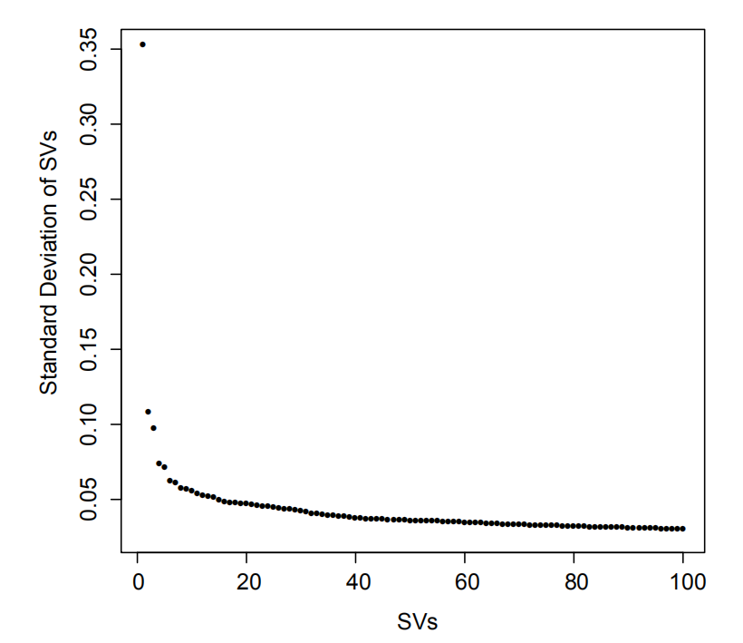
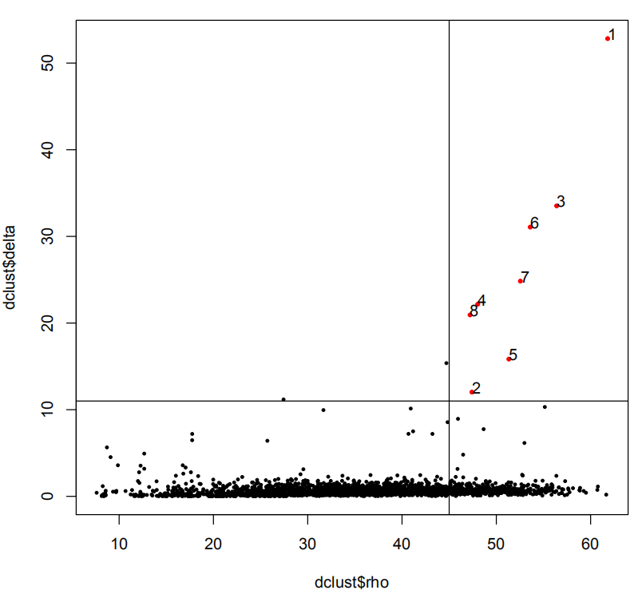
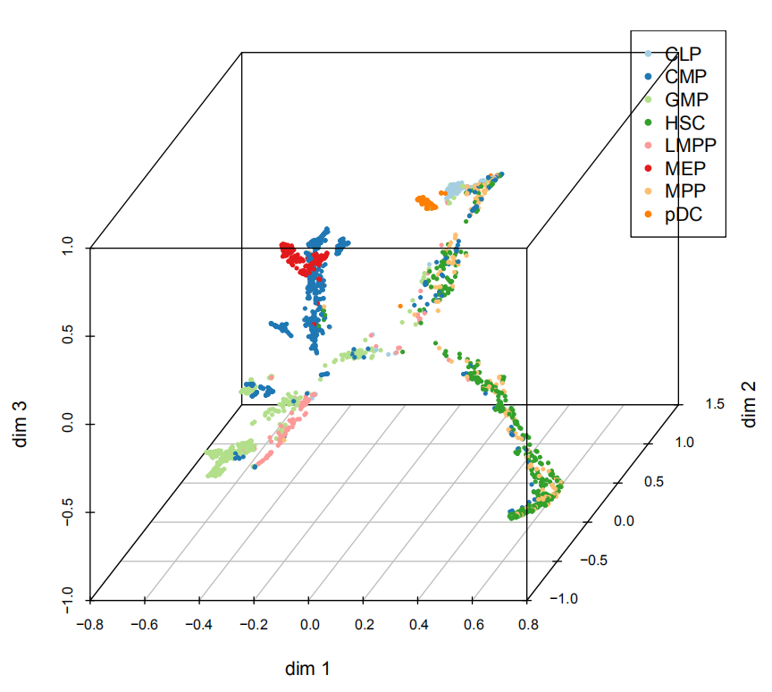
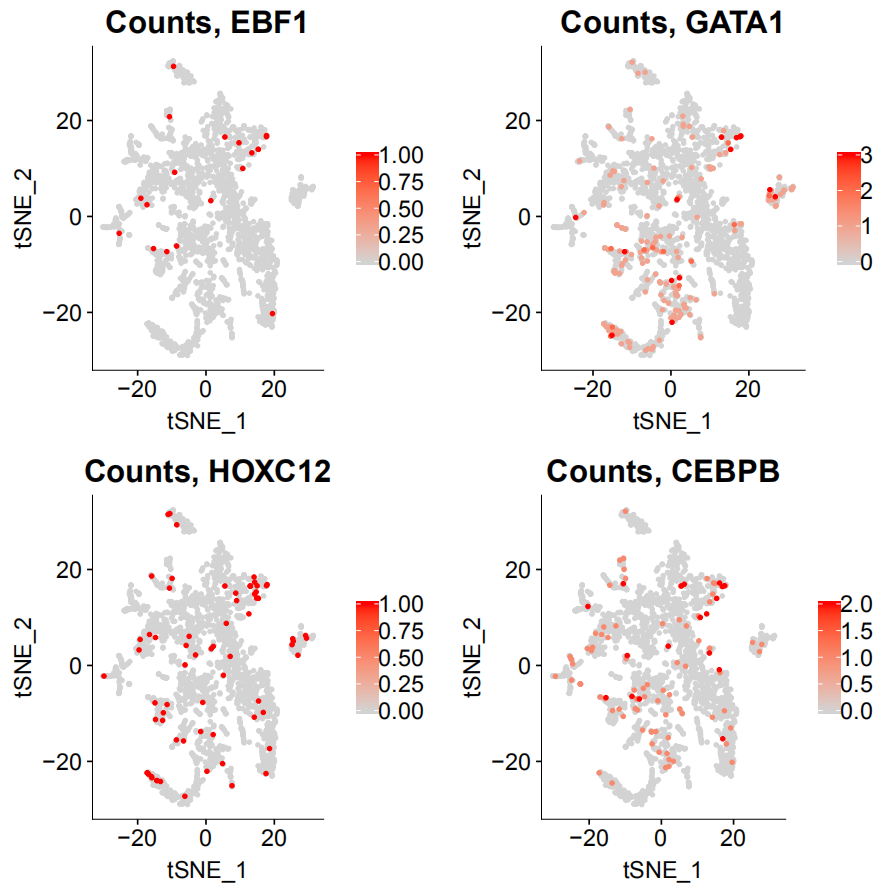
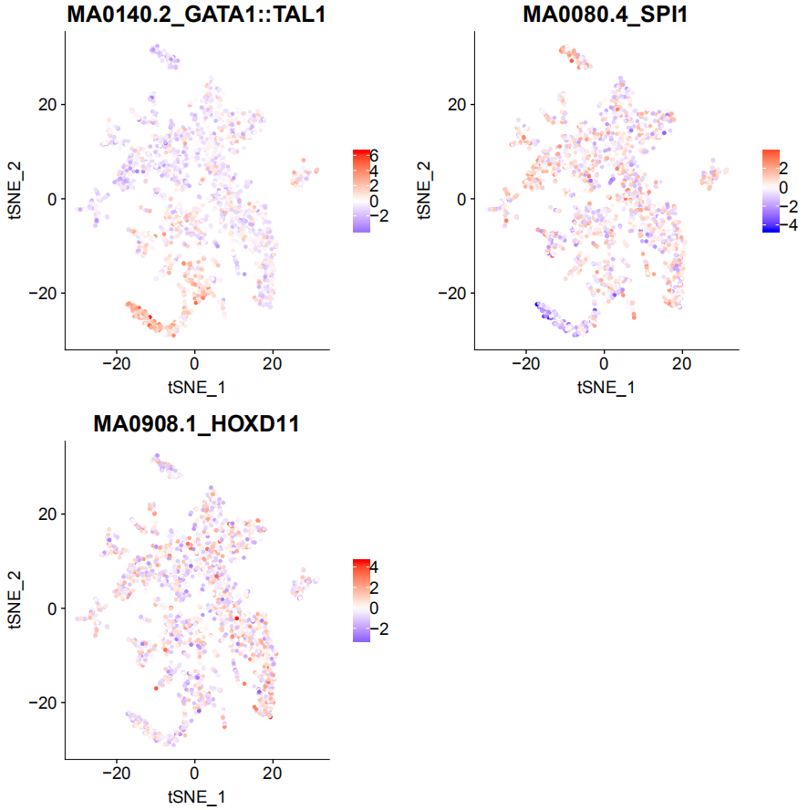

# scART

## Processed dataset 

## Dependencies (for R >= 3.4.4) 
The following packages have to be installed manually before installing scART:

```{r}
if (!requireNamespace(c("chromVAR","GenomicFeatures","GenomicRanges","motifmatchr","JASPAR2018","textTinyR","Matrix","text2vec","irlba","Rtsne","densityClust","scales","ggplot2","data.table","ChIPseeker","uwot","ggpubr","cowplot","SummarizedExperiment","monocle","RColorBrewer","scatterplot3d")),quietly = TRUE)
install.packages(c("chromVAR","GenomicFeatures","GenomicRanges","motifmatchr","JASPAR2018","textTinyR","Matrix","text2vec","irlba","Rtsne","densityClust","scales","ggplot2","data.table","ChIPseeker","uwot","ggpubr","cowplot","SummarizedExperiment","monocle","RColorBrewer","scatterplot3d"))
```

Now, you are now ready to install scART:

# source the function
```{r}
source('scART.R')
source('function.R')
```


# Load tutorial data and annotation  
```{r}
load("./data/ncounts.Rdata")
load("./data/annotation.Rdata")
```

# Creating the scART object
```{r message=FALSE, warning=FALSE, include=FALSE, paged.print=FALSE}
art <- CreatescART(data,metadata = annotation2)  
```

# Dimensionality reduction 
```{r include=FALSE}
art <- RunSim(art)
art <- DimReduce(art)
```


# Group cells into clusters

You can take a good look at the output pdf to adjust 'rho_cutoff' and 'delta_cutoff'
```{r message=FALSE, warning=FALSE, include=FALSE, paged.print=FALSE}
set.seed(10) 
art <- RunCluster(art, delta_cutoff = 11,rho_cutoff = 45)
```


# Visualize an Embedding
```{r}
set.seed(10) 
art <- RunTSNE(art, nSV=20, ndims=2, perplexity=30)
art <- RunUMAP(art, nSV=20)
Visualization_2D(art,reductions = 'TSNE') 
Visualization_2D(art,reductions = 'UMAP')
Visualization_2D(art,reductions = 'TSNE',anno="type2",color=tsnecols,fileName="cell_type") 
Visualization_2D(art,reductions = 'UMAP',anno="type2",color=tsnecols) 
library(patchwork)
p1|p2
```


# Run trajectory
art <- RunTrajectory(art, nSV=20, anno="type2")
plotTrajectory(art, anno="type2") 




# Create cell-by-gene matrix and explore gene accessibility score
```{r}
art <- MapBin2Gene(art, ### the cell-by-bin matrix
                   binFormat = 'binary_matrix', ### the format of cell-by-bin matrix
                   bin_file = NULL,
                   Org = 'hg19', ### mm10,hg19
                   OrgDb = 'org.Hs.eg.db', ### org.Mm.eg.db, org.Hs.eg.db
                   TxDb = NULL, ### if Org = manual, you should input the TxDb defined by yourself 
                   convert_mat = TRUE, ### whether convert bin-by-cell matrix to cell-by
                   TSS_window = 5000 ### the window size around TSS to define the promoter 
                   )

PlotSelectGenesATAC(art, gene2plot = c("HOXC12","GATA1","CEBPB","EBF1"), reduction = 'TSNE', ncol = 2)
```



# RunChromVAR 
```{r}
art <- RunChromVAR(
         art, ###a binary (cell-by-peak) matrix, the row of Bmat must = the number of peaks
         peak.obj = NULL, ### a GrangeList object of peak files or the directory path of ATAC peak files
         peakFormat = c('binary_matrix'), ## the format of peak object: GRangeList or peak bed file 'binary_matrix',,'peak_bed'
         Org=c('hg19'), #'mm10','hg38',
         min.count=20, ### the threshold of a peaks found at at least 10 cells
         species = c("Homo sapiens") ### default is Homo sapiens ,"Mus musculus"
)
PlotSelectTF(art, TF2plot = c('GATA1','EBF1',"SP1"), reduction = 'TSNE', ncol = 2)
```



```R
save(art,'art.Rdata')
```