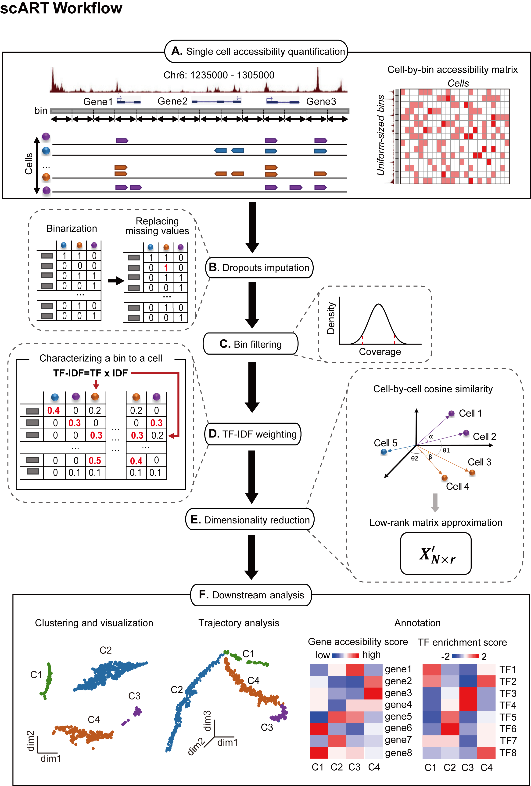
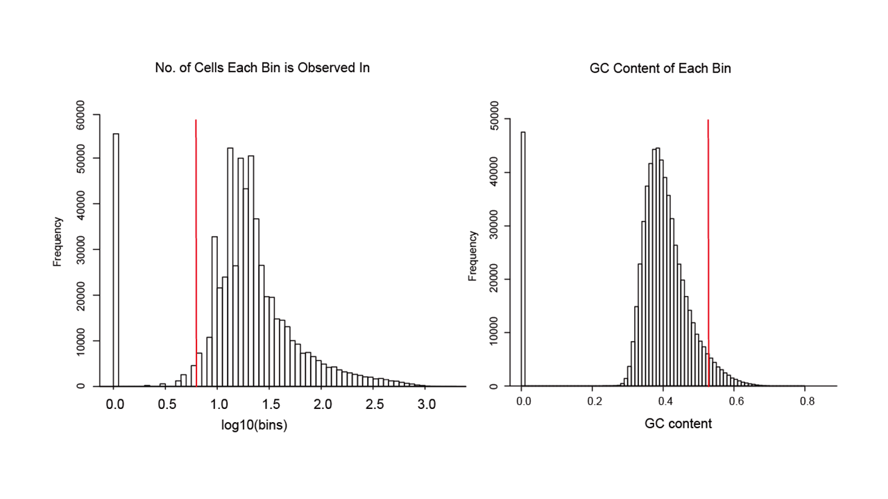
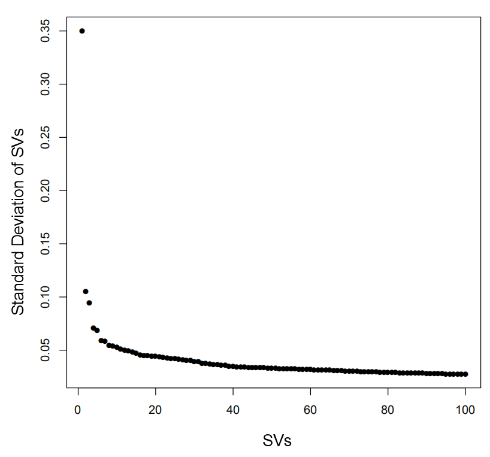
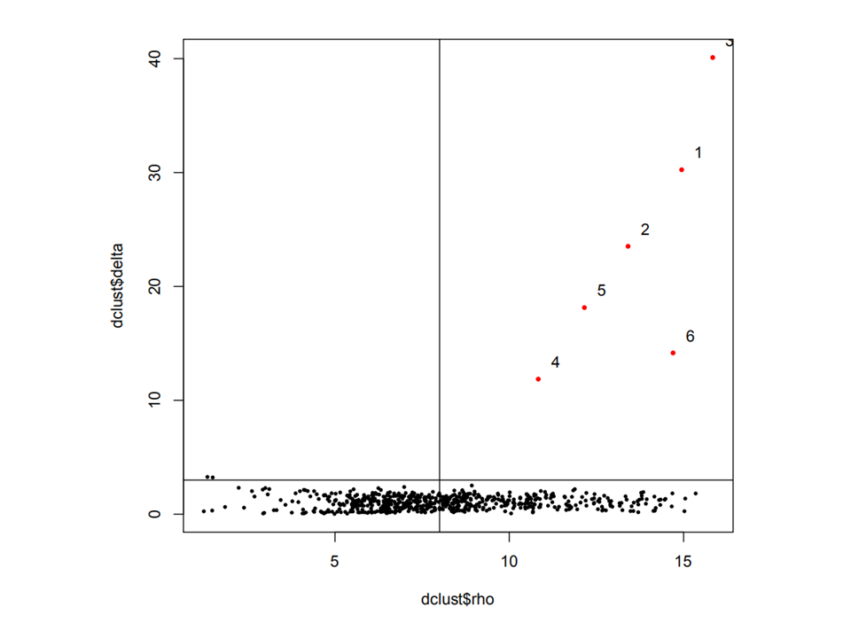
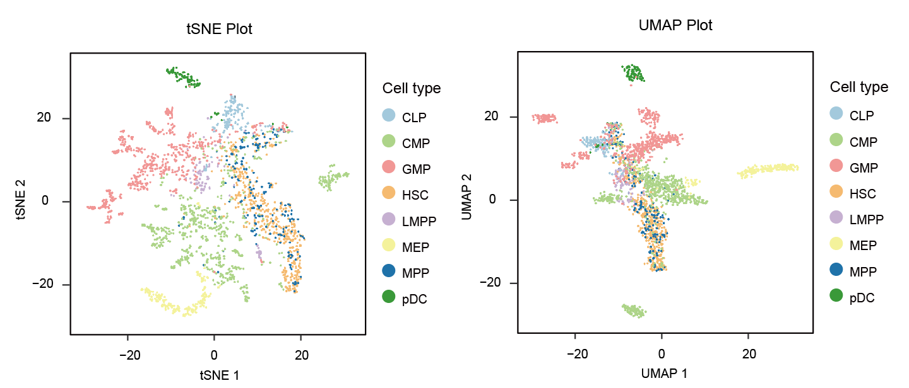
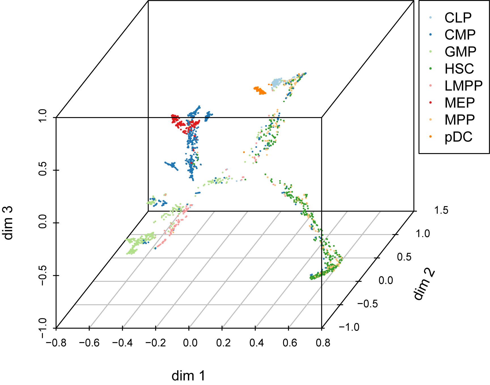
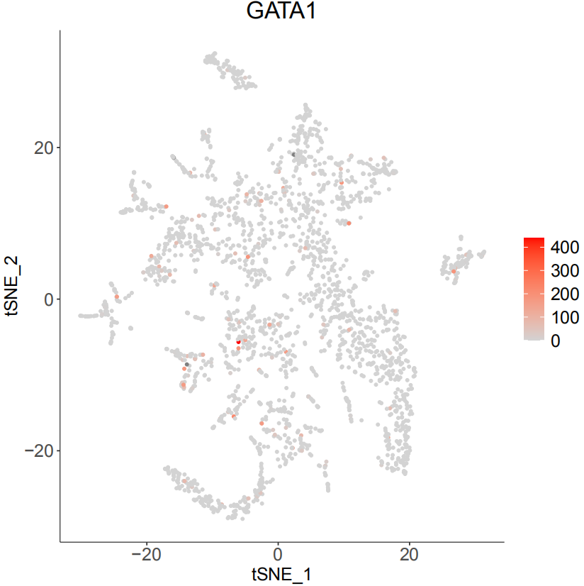
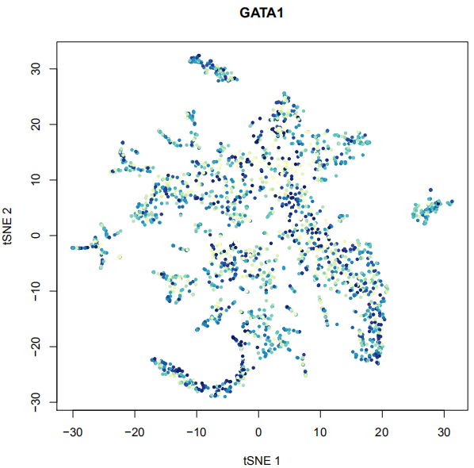

# scART

**scART** is a R package for recognizing cell clusters and constructing trajectory from single-cell epigenomic data!




## Introduction
scART is a Shen-lab in-house bioinformatics pipeline for single cell ATAC-seq (scATAC-seq).
scART is a statistical and powerfule toolkit to liminate noise and select significant features for cell state 
recognition and lineage construction from sparse single-cell epigenetic data. Using a compendium of single cell 
ATAC-seq datasets, scART exploited for robust recognizion of cell types and relevant regulons, as well as 
achieved learning developing trajectory from single-cell epigenetic data. scART decodes the regulatory heterogeneity in cell populations and reconstructed cell fate transition.

## Dependencies (for R >= 3.4.4) 
The following packages have to be installed manually before installing scART:

```{r}
if (!requireNamespace(c("chromVAR","GenomicFeatures","GenomicRanges","motifmatchr","JASPAR2018","textTinyR","Matrix","text2vec","irlba","Rtsne","densityClust","scales","ggplot2","data.table","ChIPseeker","uwot","ggpubr","cowplot","SummarizedExperiment","monocle","RColorBrewer","scatterplot3d")),quietly = TRUE)
install.packages(c("chromVAR","GenomicFeatures","GenomicRanges","motifmatchr","JASPAR2018","textTinyR","Matrix","text2vec","irlba","Rtsne","densityClust","scales","ggplot2","data.table","ChIPseeker","uwot","ggpubr","cowplot","SummarizedExperiment","monocle","RColorBrewer","scatterplot3d"))
```

Now, you are now ready to install scART:

# source the function
```{r}
source('scART.R')
source('function.R')
```

# Creating the scART object
```{r message=FALSE, warning=FALSE, include=FALSE, paged.print=FALSE}
art <- CreatescART(data,metadata = annotation)  
# You can also use snap/10X output directory by Read_snap and Read_10X(Read_10X_h5) respectively.
# Or you can put the barcodes.tsv, bins.bed, matrix.mtx in a fold and provide Read_counts() with the fold address.
```


# Load tutorial data and annotation  
```{r}
load('tutorial_data.Rdata')
```


# Data pre-precesssing: replacing missing value and filtering bins
```{r}
art <- RunImputation(art,k=1)
art <- SparseFilter(art, ncell=2, ncell2=0.8, ncell3=2, nbin=10)
```



# Dimensionality reduction 
```{r include=FALSE}
art <- RunSim(art)
art <- DimReduce(art)
```



# Group cells into clusters

You can take a good look at the output pdf to adjust 'rho_cutoff' and 'delta_cutoff'
```{r message=FALSE, warning=FALSE, include=FALSE, paged.print=FALSE}
set.seed(10) 
art <- RunCluster(art,delta_cutoff = 11,rho_cutoff = 45)
```



# Visualize an Embedding
```{r}
set.seed(10) 
art <- RunTSNE(art, nSV=20, ndims=2, perplexity=30)
art <- RunUMAP(art)
p1 <- Visualization_2D(art,reductions = 'UMAP') 
p2 <- Visualization_2D(art,reductions = 'TSNE')
library(patchwork)
p1|p2
```



# Trajectory analysis and visualization
```{r}
art <- RunTrajectory(art, anno='cell_type', nSV = 20, ndim= 3, gamma = 10)
plotTrajectory(art)
```



# Create cell-by-gene matrix and explore gene accessibility score
```{r}
art <- MapBin2Gene(art, Org = 'hg19')
PlotSelectGenesATAC(art, gene2plot = c('GATA1','EBF1'))  
```



# RunChromVAR 
```{r}
art <- RunChromVAR(art,Org=c('hg19'),species = c("Homo sapiens") ,min.count=10)
PlotSelectTF(art,TF2plot=c('GATA1'))
### min.count:the threshold of a peaks found at at least 10 cells
```



```R
save(art,'scart.Rdata')
```

