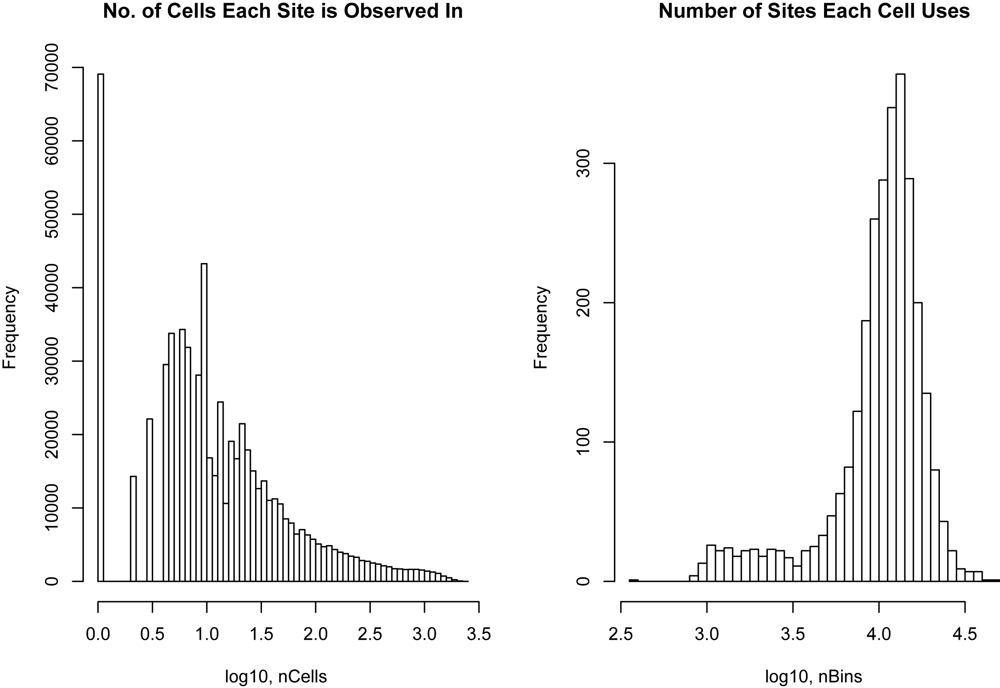
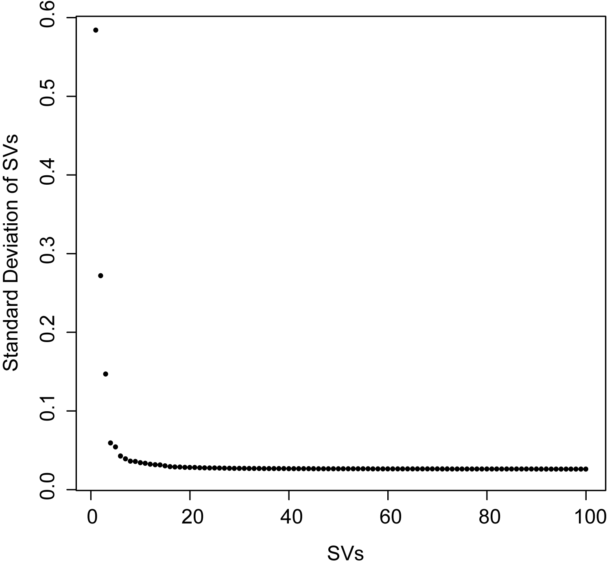
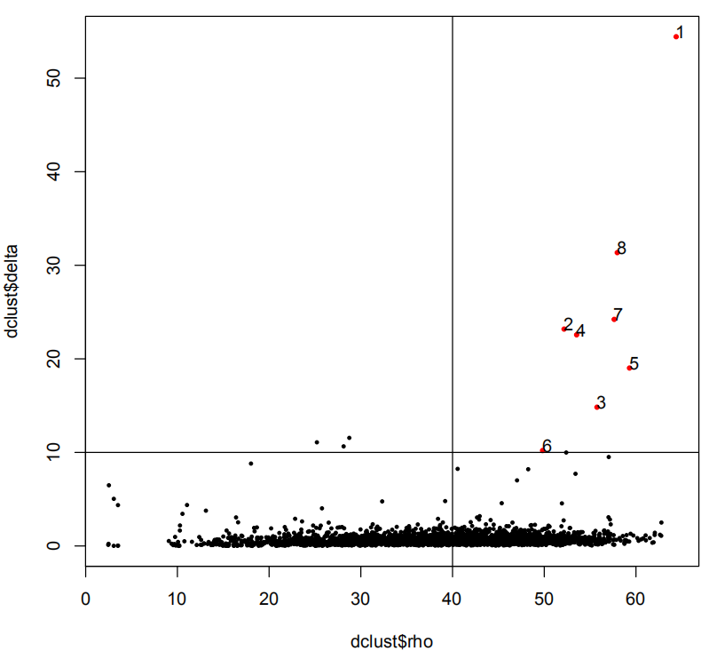
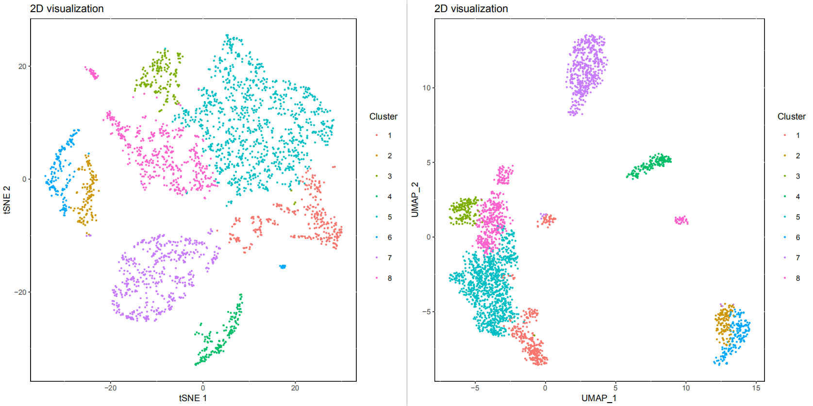
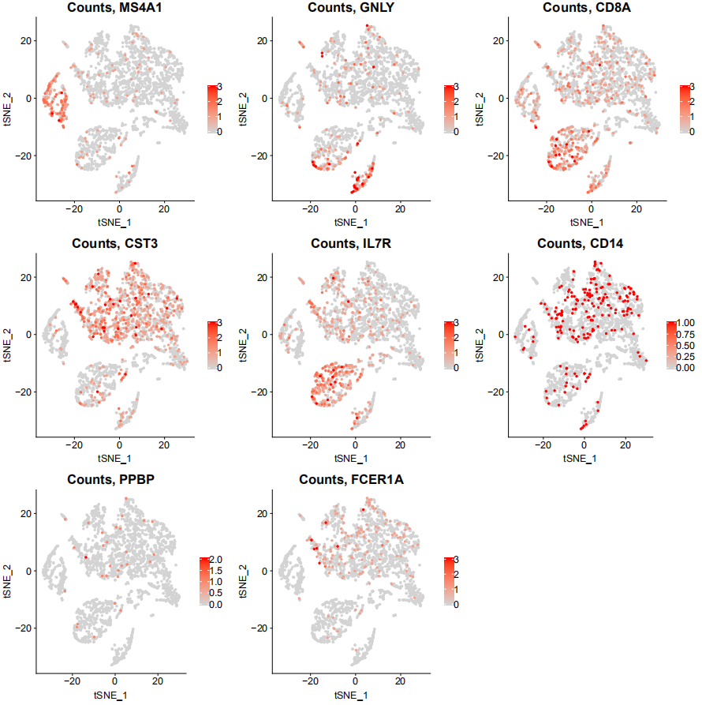

# scART

## scATAC-seq dataset of 5k Peripheral blood mononuclear cells (PBMCs) from a healthy donor from 10X  Genomics
# dowload links:
https://support.10xgenomics.com/single-cell-atac/datasets/1.2.0/atac_pbmc_5k_v1


## Dependencies (for R >= 3.4.4) 
```{r}
if (!requireNamespace(c("chromVAR","GenomicFeatures","GenomicRanges","motifmatchr","JASPAR2018","textTinyR","Matrix","text2vec","irlba","Rtsne","densityClust","scales","ggplot2","data.table","ChIPseeker","uwot","ggpubr","cowplot","SummarizedExperiment","monocle","RColorBrewer","scatterplot3d")),quietly = TRUE)
install.packages(c("chromVAR","GenomicFeatures","GenomicRanges","motifmatchr","JASPAR2018","textTinyR","Matrix","text2vec","irlba","Rtsne","densityClust","scales","ggplot2","data.table","ChIPseeker","uwot","ggpubr","cowplot","SummarizedExperiment","monocle","RColorBrewer","scatterplot3d"))
```

Now, you are now ready to install scART:

## source the function
```{r}
source('scART.R')
source('function.R')
```

## You can create art through SnapATAC 
https://github.com/r3fang/SnapATAC/wiki/FAQs


## Creating the scART object
```{r message=FALSE, warning=FALSE, include=FALSE, paged.print=FALSE}
library(SnapATAC)
sample <- "10X_5k_pbmc"
file="data/10X_pmsc/atac_pbmc_5k_nextgem.snap"
barcode="data/10X_pmsc/atac_pbmc_5k_nextgem_singlecell.csv"
art <- Read_snap(file,barcode,sample=sample,bin.size=5000 )
art <- RunImputation(art, k=1, ratio=1)
art <- SparseFilter(art, ncell=5, ncell2=0.75, ncell3=2.5, nbin=10, genome='hg19')
```



## Dimensionality reduction 
```{r include=FALSE}
art <- RunSim(art)
art <- DimReduce(art, n=100, num=100, scale=F)
```



## Group cells into clusters
You can take a good look at the output pdf to adjust 'rho_cutoff' and 'delta_cutoff'
```{r message=FALSE, warning=FALSE, include=FALSE, paged.print=FALSE}
set.seed(10) 
art <- RunCluster(art, nSV=12, delta_cutoff = 10, rho_cutoff = 40)
```


## Visualize an Embedding
```{r}
set.seed(10) 
art <- RunTSNE(art, nSV=20, ndims=2, perplexity=30)
art <- RunUMAP(art)
p1 <- Visualization_2D(art,reductions = 'UMAP') 
p2 <- Visualization_2D(art,reductions = 'TSNE')
library(patchwork)
p1|p2
```



## Create cell-by-gene matrix and explore gene accessibility score
```{r}
art <- MapBin2Gene(art, ### the cell-by-bin matrix
                   binFormat = 'binary_matrix', ### the format of cell-by-bin matrix
                   bin_file = NULL,
                   Org = 'hg19', ### mm10,hg19
                   OrgDb = 'org.Hs.eg.db', ### org.Mm.eg.db, org.Hs.eg.db
                   TxDb = NULL, ### if Org = manual, you should input the TxDb defined by yourself 
                   convert_mat = TRUE, ### whether convert bin-by-cell matrix to cell-by
                   TSS_window = 5000 ### the window size around TSS to define the promoter 
                   )

PlotSelectGenesATAC(art, 
                    gene2plot = c("IL7R","CD14","CD8A","MS4A1","GNLY","PPBP","CST3","FCER1A"), 
                    reduction = 'TSNE', ncol = 3)
```



## Conver art to Seurat
seurat <- art2seurat(art)


## Save art 
```R
save(art,'art.Rdata')
```
