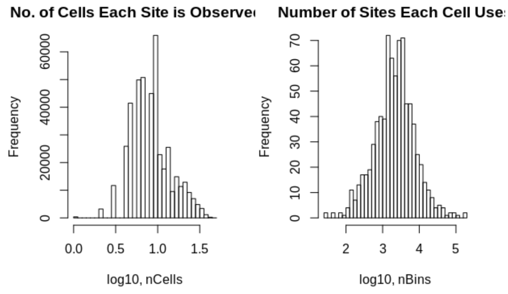
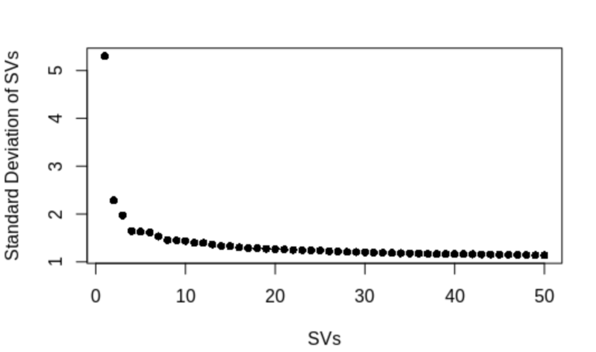
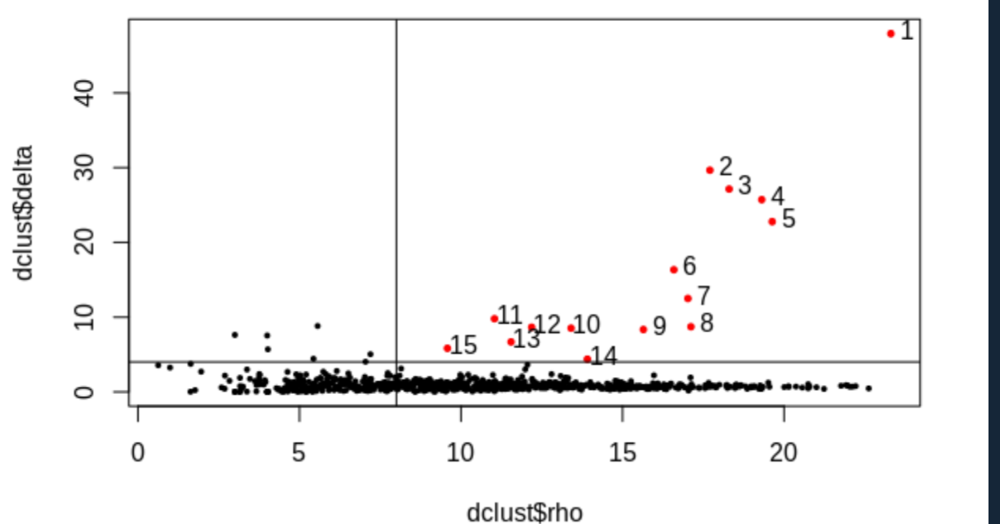
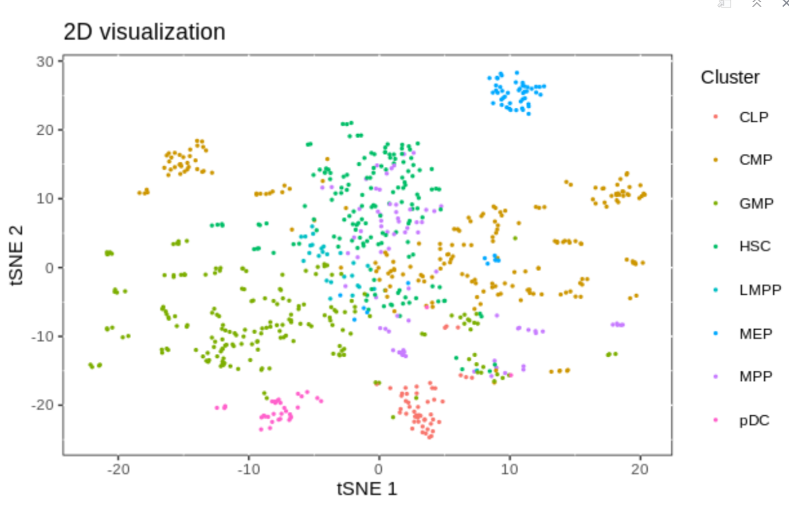
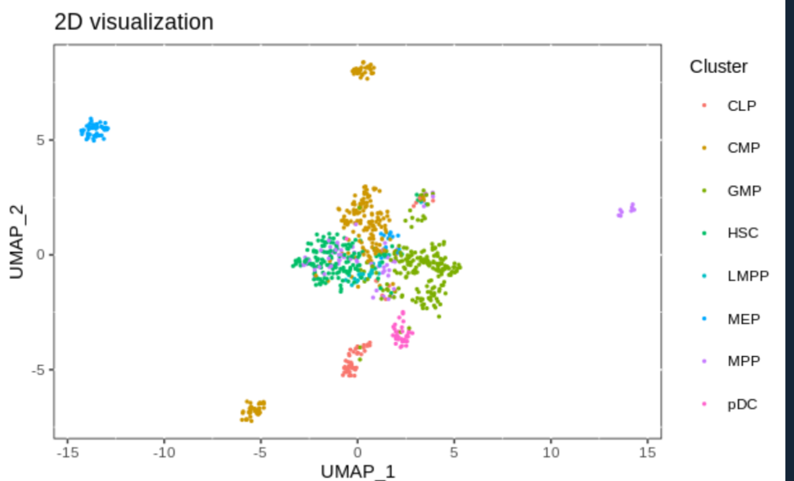
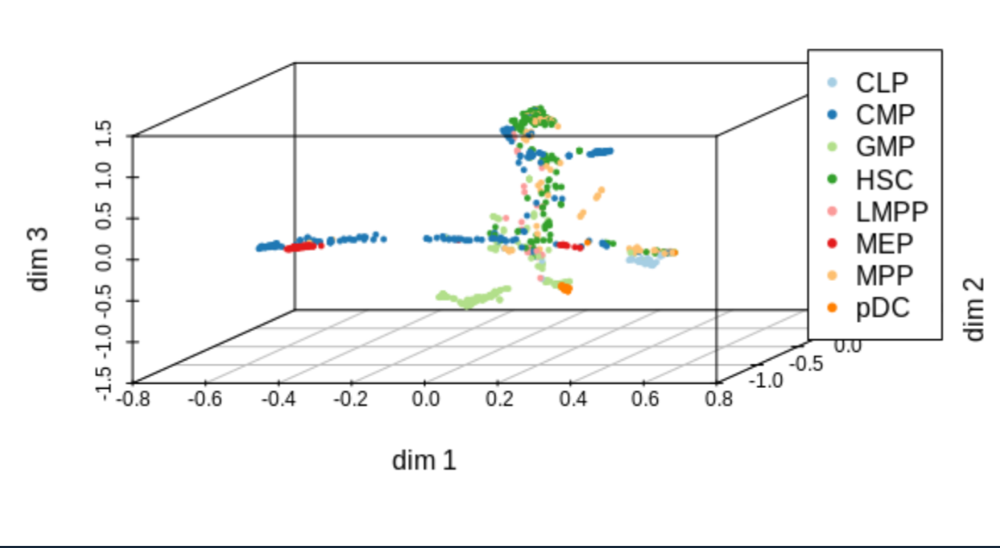
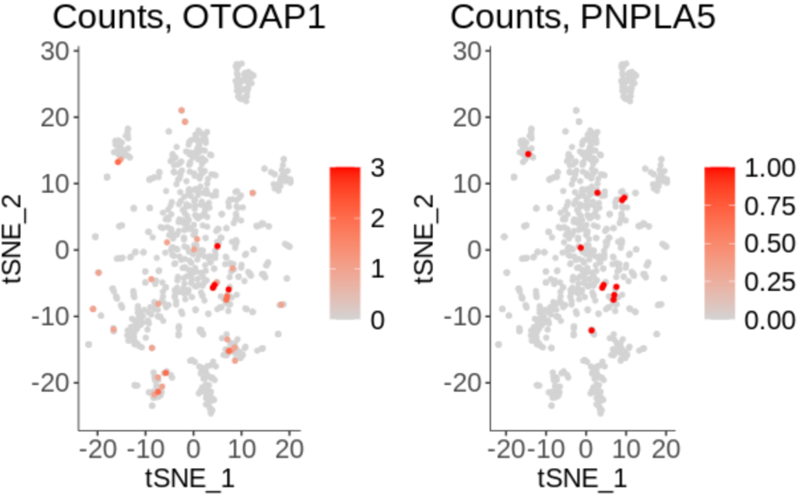
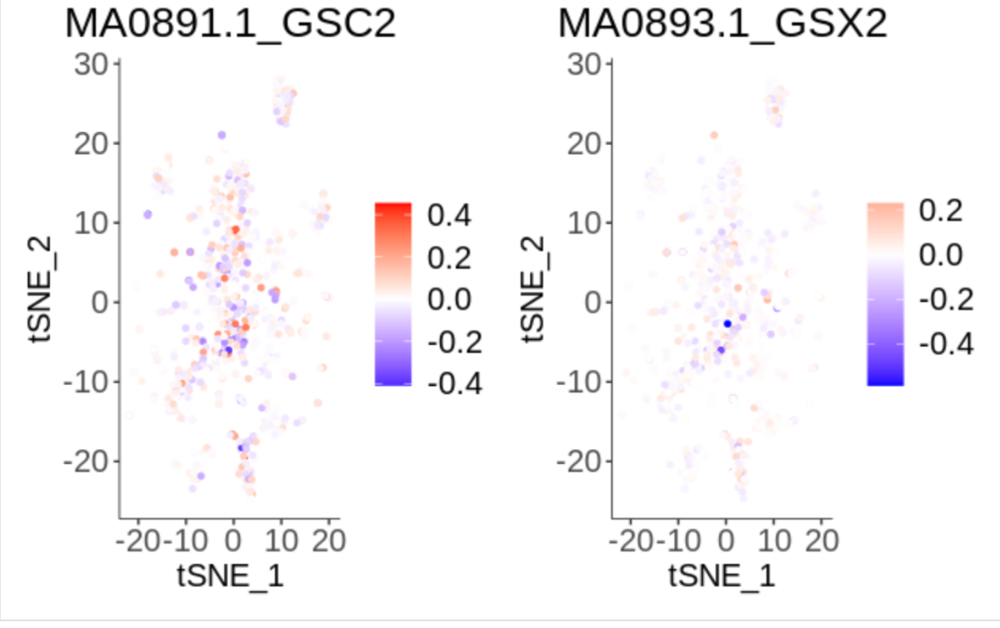

# Load the package and tutorial data

```{r}
source('function.R')
source('scART.R')
load('test_step.Rdata')

```

# Create the scART object, impute missing value and filter data
```{r message=FALSE, warning=FALSE, include=FALSE, paged.print=FALSE}
art<-CreatescART(ncounts,metadata = anno)  #metadata = annotation)
art<-RunImputation(art,k=1)
art<-SparseFilter(art, ncell=2, ncell2=0.8, ncell3=2, nbin=10)
```


# Reduce Dimensionality 

```{r include=FALSE}
art<-RunSim(art)
art<-DimReduce(art)
```



```{r}
art<-RunTSNE(art, nSV=40, ndims=2, perplexity=30,seed.use = 10)
art<-RunUMAP(art ,seed.use = 10,nSV=40)
```
# Group cells into clusters, you can take a good look at the output pdf to adjust 'rho_cutoff' and 'delta_cutoff'
```{r message=FALSE, warning=FALSE, include=FALSE, paged.print=FALSE}
art<-RunCluster(art,delta_cutoff = 4,rho_cutoff = 8)
```


# Visualize an Embedding

```{r}
Visualization_2D(art,reductions = 'TSNE',anno='type2',size = c(1,1))
```



```{r}
Visualization_2D(art,reductions = 'UMAP',anno='type2',size = c(1,1))
```



# Run and plot trajectory

```{r}
art<-RunTrajectory(art,nSV = 20,ndim =10,gamma = 10)
plotTrajectory(art,anno='type2')
```



# Create cell-gene matrix and explore gene chromtin accessibility

```{r}
art<-MapBin2Gene(art,Org = 'hg19')
PlotSelectGenesATAC(art,gene2plot = c('OTOAP1','PNPLA5'))  

```



```{r}
art<-RunChromVAR(art,Org=c('hg19'),species = c("Homo sapiens") ,min.count=10)
### min.count:the threshold of a peaks found at at least 10 cells
PlotSelectTF(art,)
```




```{r}
seurat=art2seurat(art)
snap=art2snap(art)
```